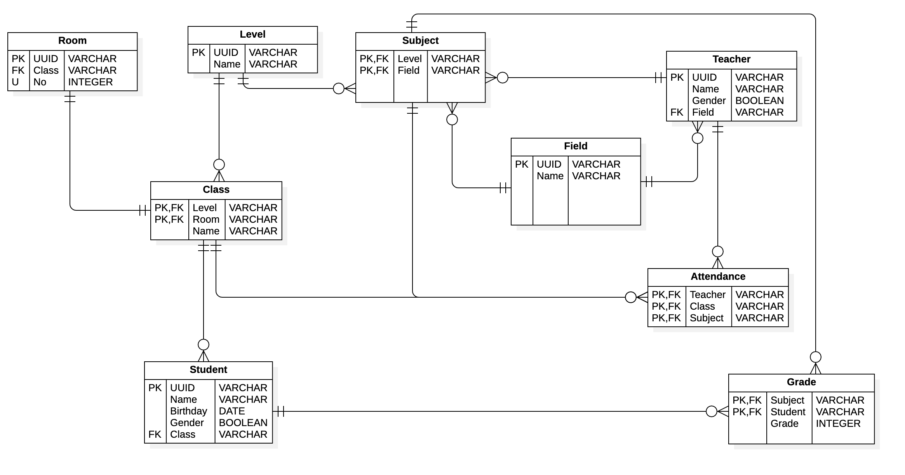

## Khởi tạo cơ sở dữ liệu thử nghiệm về trường học (cấp 3)



### Dựa vào lược đồ ER, hãy khởi tạo một CSDL dạng JSON và CSV với các ràng buộc sau:

1. UUID được sử dụng là phiên bản 4.
2. Một trường cấp có tối đa 100 phòng học (Room), mỗi phòng học được đánh số thứ tự từ 1 đến N.
3. Các phòng học được chia đều cho 3 khối (Level), bao gồm khối 10, 11 và 12. Thông thường số phòng sẽ giảm từ 1 đến 2 phòng do khi học viên được chuyển lên các khối cao hơn.
4. Mỗi khối (Level) có từ 8 đến 10 môn học (Subject), các môn học thuộc về một lĩnh vực (Field) nào đó bao gồm Toán, Lý, Hóa, Ngữ Văn, Thể Dục...
5. Với mỗi phòng học sẽ có một lớp học (Class), mỗi lớp học thuộc về một khối và có sỉ số khoảng từ 30 đến 50 học viên (Student).
6. Mỗi học viên có các thông tin bao gồm Họ tên, Ngày tháng năm sinh, Giới tính và phải thuộc về một lớp học nào đó. Số tuổi đối với học sinh khối 10 phải nằm trong khoảng từ 15 đến 19, khối 11 từ 16 đến 20 và khối 12 từ 17 đến 21.
7. Mỗi giáo viên phải có một lĩnh vực (Field) giảng dạy, giảng dạy các môn học (Subject) thuộc một hoặc nhiều khối và buộc phải tham dự (Attendance) từ 4 đến 10 lớp (Class).
8. Trong từng môn học, học sinh sẽ có điểm số riêng (Grade).
9. Biết rằng tổng số học viên của trường dao động từ 500 đến 3000.

### Các yêu cầu trong LAB
1. Chương trình dược viết trên mô hình OOP và được sử dụng yêu cầu sử dụng try, catch và exception để handle Error. 
2. Sử dụng công nghệ GIT để quản mã nguồn, ứng với mỗi hàm được viết mới hoặc cập nhật, học viên được yêu cầu phải thực hiện commit. Mã nguồn phải được xuất bản trên Github và lịch sử phát triển của mã nguồn phải thể hiện được quá trình liên tục. 
3. Ứng dụng cung cấp giao diện dòng lệnh cơ bản CLI, hổ trợ các cú pháp sau:

```bash
# Khởi tạo database trường học với sinh viên và số phòng học ngẫu nhiên, nằm trong yêu cầu ràng buộc của đề bài
./schoolDatabaseGenerator
Succesful: You have a new school database with 1023 students and 32 rooms

# Hướng dẫn sử dụng
./schoolDatabaseGenerator -h
Help: 
	./schoolDatabaseGenerator <<school_name>>: Generate a school database with number students in range 500 to 3000, and the largest number rooms is 100 
	./schoolDatabaseGenerator <<school_name>> -s <<number_students>>: Generate a school database with <<number_students>> in range 500 to 3000 and the largest number rooms is 100 
	./schoolDatabaseGenerator <<school_name>> -r <<number_rooms>>: Generate a school database with <<number_rooms>> and number students in range 500 to 3000.
	./schoolDatabaseGenerator <<school_name>> -s <<number_students>> -r <<number_rooms>>: Generate a school database with <<number_students>> and <<number_rooms>>.

# Khởi tạo database trường học với 3000 học viên
./schoolDatabaseGenerator <<school_name>> -s 3000
Succesful: You have a new school database with 3000 students and 54 rooms

# Báo lỗi khi số học viên vượt quá yêu cầu của bài toán
./schoolDatabaseGenerator <<school_name>> -s 5000
Error: You must input number student in range 500 to 3000

# Khởi tạo database trường học với 45 phòng học
./schoolDatabaseGenerator <<school_name>> -r 45
Succesful: You have a new school database with 1800 students and 45 rooms

# Khởi tạo database trường học với 2000 học viên và 40 lớp học
./schoolDatabaseGenerator <<school_name>> -s 2000 -r 40
Succesful: You have a new school database with 2000 students and 40 rooms
# hoặc
./schoolDatabaseGenerator <<school_name>> -r 40 -s 2000
Succesful: You have a new school database with 2000 students and 40 rooms
```

3. Đầu ra của ứng dụng là **thư mục** ứng với giá trị nhập vào của agrument `<<school_name>>`, bao gồm các File sau: `<<school_name>>.json` chuẩn json chứa toàn bộ data được tạo ứng với các thực thể (Entity) có trong lược đồ, các file .csv với tên file là tên các thực thể tương ứng và nội dung là các bảng dữ liệu.

```json
// File json sẽ có chuẩn như sau:
{
  "Rooms": [
    {
      "UUID": "e8e3db08-dc39-48ea-a3db-08dc3958eafb",
      "Class": "0f75d295-9a88-462b-b3a3-e9f192d1fec7"
      "No": 1
    },
    {
      "UUID": "037d4f5a-7053-45e1-be34-6e7e9bfec293",
      "Class": "bf8b109d-ba34-40a9-8219-e6d6aa41d692"
      "No": 2
    },
    ...
  ],
  "Levels": [
    {
      "UUID": "2ed0346b-1569-4bca-bd7d-011e42aa0d81",
      "Name": "10"
    },
		...
  ],
	...
}
```

```bash
# File csv sẽ có chuẩn như các ví dụ sau:
# File Rooms.csv
UUID, Class, No
e8e3db08-dc39-48ea-a3db-08dc3958eafb, 0f75d295-9a88-462b-b3a3-e9f192d1fec7, 1
037d4f5a-7053-45e1-be34-6e7e9bfec293, bf8b109d-ba34-40a9-8219-e6d6aa41d692, 2
...
# File Levels.csv
UUID, Name
2ed0346b-1569-4bca-bd7d-011e42aa0d81, 10
...
# Các file csv khác có format tương tự
```

3. Mã nguồn buộc phải phát triển trên nền tảng .NET Core. Học viên phải hoàn tất việc release trên Visual Studio.
4. Với mỗi phương thức (method) và thuộc tính (property), lớp (class), học viên đều buộc phải viết ghi chú dưới dạng chuẩn XML (xem thêm tại https://docs.microsoft.com/en-us/dotnet/csharp/codedoc). Các tag yêu cầu bao gồm: param, value, summary, returns, exception.
5. Các ghi chú, tóm lược, điểm nỗi bật hoặc sáng tạo của trong project của học viên được trình bày trong file README.md bằng ngôn ngữ markdown.

**Deadline:** 23h00 14/06/2020. Sau deadline mọi commit sẽ không được xem xét. 

**NOTE**: Các yêu cầu 1 và 5 là tiên quyết, giảng viên sẽ loại những dự án không đảm bảo các yêu cầu này. Điểm số xác định bằng số testcase mà ứng dụng của học viên có thể vượt qua (8 cases). Tất cả các source code được phần mềm phân tích là sao chép sẽ bị cấm thi. Yêu cầu 6 chiếm 20% trọng số của bài LAB và điểm số này chỉ đạt được khi học viên xây dựng được điểm 